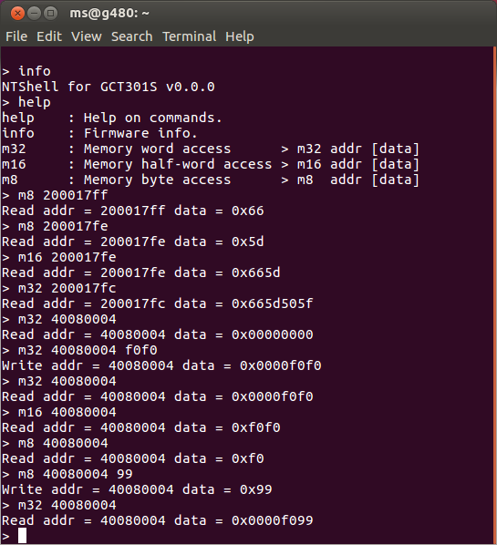

# Natural Tiny Shell for GCT301S

Currently implemented 5 shell commands:
1. help
2. info
3. m32 address [data]
4. m16 address [data]
5. m8  address [data]

Address and data are hex strings, without the leading 0x.
If data is not specified, the memory access is read access.

